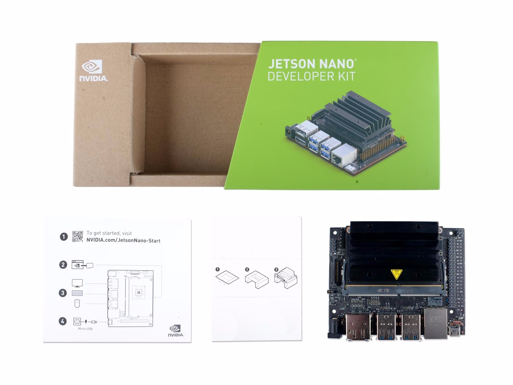

# Jetson Nano开箱&两个视觉Demo展示


字数：700字
阅读时间：20分钟

**目录**

[TOC]

### 摘要
如你所知，Jetson Nano现在是一款热点产品。它可以广泛地将神经网络技术应用到嵌入式系统中。这是一篇关于产品细节、启动过程和两个视觉Demo的文章.


### 1.什么是Jetson Nano？

让我先简单介绍一下。
>Nvidia®Jetson nano™开发工具包提供计算性能，以前所未有的规模、功率和成本运行现代人工智能工作负载。开发人员、学习者和制造商现在可以运行用于图像分类、对象检测、分割和语音处理等应用程序的人工智能框架和模型。

>您可以在[官方页面](https://developer.nvidia.com/embedded/buy/jetson-nano-devkit)上找到更多信息。


您可以简单地将其视为一个具有更多的计算资源的树莓PI，足以支持部署大型中性网络以实现各种应用。比如我正打算写一个自动识别&喂猫的应用……


### 2. 开箱
#### 套件包括：

1. Jetson Nano
2. 说明书
3. 一个折叠的硬纸板支架
4. 启动

<iframe width="560" height="315" src="https://www.youtube.com/embed/QH-M4MjFuEY" frameborder="0" allow="accelerometer; autoplay; encrypted-media; gyroscope; picture-in-picture" allowfullscreen></iframe>




### 3.如何启动
#### 准备工作
##### 您需要准备：

1. 16GB microSD卡+

2. USB键盘和鼠标

3. 屏幕（HDMI或DP）

4. 微型USB（5V_4A）或电源插座（5V_4A电源）。接受2.1×5.5×9.5 mm插头

正极性）

5. 可以连接到互联网并烧录microSD卡的笔记本电脑。

6. 以太网线路


##### 注意事项：

>- 并非所有标称5伏的电源都能稳定地达到额定功率。根据我的测试，Jetson nano对电源非常敏感，即使是轻微的功率波动也会导致它崩溃。您必须购买高质量的电源适配器。

>- 即使是USB设备也不能热插拔，否则会黑屏（原因未知）。

>- 如果没有跳线帽，套件可以由J28 microUSB连接器供电。连接跳线帽和，套件可以通过J25电源插座供电。

>- 没有重置按钮，所以每次它崩溃时，都必须通过手动断电重新启动它。

>- 无内置WiFi模块。

>- 无蓝牙模块。


##### 一个简短的教程。

JetsonNano的启动步骤与其他ARMLinuxBorad相同。这里附了一个简短的教程。可以作参考。

>1. 下载[系统映像](https://developer.nvidia.com/embedded/dlc/jetson-nano-dev-kit-sd-card-image)
>2. 把它烧到你的SD卡上。这里有许多工具可以完成这项工作。建议使用[\[win32diskimager\]](https://sourceforge.net/projects/win32diskimager)

>3. 将USB拇指驱动器或SD或microSD卡插入计算机。它应该被检测到并在Windows中显示为驱动器。

>4. 打开win32 disk imager，选择要作为图像文件写入的.img或图像文件，选择USB或SD驱动器作为设备，然后点击“写入”。

>5. 写入过程可能需要一段时间。完成后，取出USB拇指驱动器或SD卡并将其插入Nano 。

>6. 将MicroSD卡（与系统图像一起写入）插入Jetson nano模块的底部。

>7. 打开电源，当开发工具包启动时，micro-usb接口旁边的绿色LED灯将亮起。

>8. 当您第一次启动时，jetson nano开发套件将指导您完成一些初始设置，包括选择系统语言、键盘布局等。
>9. 最后，您将看到这个界面。祝贺你！
>

 
### 4.视觉Demo

<iframe width="560" height="315" src="https://www.youtube.com/embed/U0rNdI9pl_0" frameborder="0" allow="accelerometer; autoplay; encrypted-media; gyroscope; picture-in-picture" allowfullscreen></iframe>

##### 注意事项：
> 这里官方demo的相机启动代码有点问题，需要自己配置。详细信息如下：

>- jetson utils/camera/gstcamera.h的第80行配置**帧大小**：


>```cpp
		static const uint32_t DefaultWidth  = 1280;
		static const uint32_t DefaultHight = 720;
		
>```


> - jetson-inference/imagenet-camera/imagenet-camera.cpp 的37行（其他demo同理）配置**相机编号** . 在有些代码里，相机编号没有宏定义，如果遇到问题了还得手动找到并配置(比如gstCamera.c), 
 
>```cpp
		#define DEFAULT_CAMERA -1
>```


> - 可以用终端指令 `V4L2-ctl` 查询相机信息
>```  
		V4L2-ctl --device=$d -D --list-formats
>```

		
感谢阅读！


